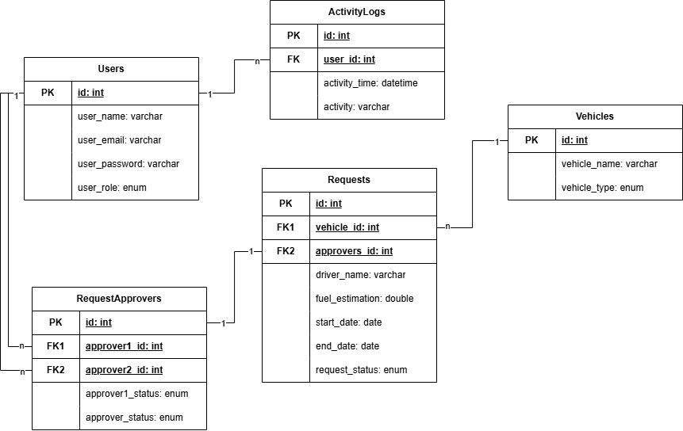

<a id="readme-top"></a>
<div align="center">
    <h3 align="center">Vehicle Pool Request System</h3>
    <p align="center">
        Website yang ditujukan untuk mengelola sistem permohonan penggunaan kendaraan milik perusahaan tambang nikel.
    </p>
</div>


<br>
<details>
    <summary>Table of Contents</summary>
    <ol>
        <li>
            <a href="#about-the-project" style="color: black;">About The Project</a>
            <ul>
                <li><a href="#built-with" style="color: black;">Built With</a></li>
            </ul>
        </li>
        <li>
            <a href="#diagram" style="color: black;">Diagram<a>
            <ul>
                <li><a href="#entity-relation-diagram" style="color: black">Entity Relation Diagram</a></li>
                <li><a href="#activity-diagram" style="color: black">Activity Diagram</a></li>
            </ul>
        </li>
        <li><a href="#how-to-use" style="color: black;">How to Use</a></li>
    </ol>
</details>


## About The Project

Project ini merupakan tahapan Technical Test dari proses seleksi Magang Fullstack Developer di PT Sekawan Media Informatika.

<p align="right">(<a href="#readme-top" style="color: black;">back to top</a>)</p>

### Built With

* ![Laravel]
* ![PHP]
* ![MySQL]

## Diagram

#### Entity Relation Diagram


#### Activity Diagram

1. Menambahkan Request <br>
    <br>
2. Merespons Request <br>
    <br>
   

<p align="right">(<a href="#readme-top" style="color: black;">back to top</a>)</p>

## How To Use

1. Jalankan command ini pada terminal yang dapat mejalankan perintah git di direktori yang Anda inginkan.<br>
   ```git clone https://github.com/rzqmhb/PoolingRequestSystem.git```
   <br>

2. Kemudian jalankan command ini.<br>
   ```cd PoolingRequestSystem```
   <br>

3. Instal dependency yang idperlukan oleh sistem menggunakan.<br>
   ```composer install```
   <br>

4. Buat sebuah copy dari file .env.example dengan command.<br>
   ```cp .env.example .env```
   <br>

5. Isilah file .env dengan informasi yang sesuai dengan database yang Anda miliki.
6. Buat aplication key menggunakan command.<br>
   ```php artisan key:generate```
   <br>

7. Jalankan aplikasi web sistem menggunakan command.<br>
   ```php artisan serve```
   <br>


### Email dan Password Akun

#### Admin

1. Email: sujatmiko@domain.com
   Password: sujatmiko111

#### Approver

1. Email: budi@domain.com
   Password: budi111
   <br>
2. Email: adam@domain.com
   Password: adam111
   <br>
3. Email: aryo@domain.com
   Password: aryo111

<p align="right">(<a href="#readme-top" style="color: black;">back to top</a>)</p>


[Laravel]: https://badgen.net/badge/Laravel/v10.48.17?icon=https://cdn.worldvectorlogo.com/logos/laravel-2.svg
[PHP]: https://badgen.net/badge/PHP/v8.2.4?icon=https://www.php.net/images/logos/new-php-logo.svg
[MySQL]: https://badgen.net/badge/MySQL/v8.2.4?icon=https://cdn.worldvectorlogo.com/logos/mysql-3.svg
